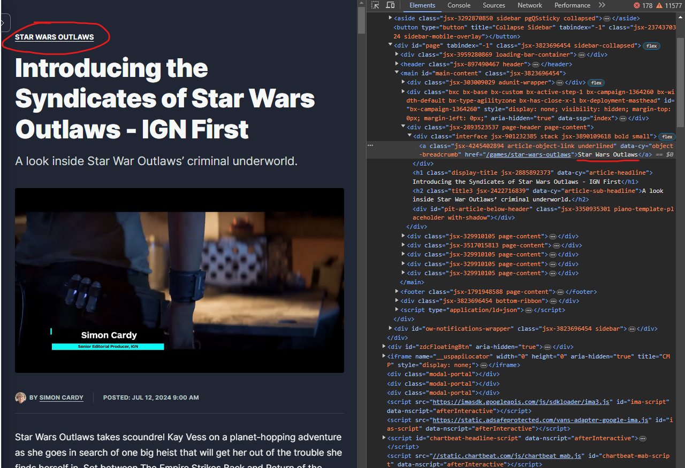

This project will aim to determine what video games are trending in a given timeframe by the number of articles written about them from gaming news websites. The crawler will collect html data of game-related articles into an Elasticsearch container. We can then extract game titles from the article titles, tags, or categories, depending on the structure of the website. Each one may need a different method of parsing titles. For example, IGN sorts games by categories, but Game Informer may only place game titles in headlines. We can use the URLs to determine which method to use to obtain the game titles each article is, at least primarily, about. We can then use publication dates to filter through our collection to get our desired statistics.

Example 1: [Article from IGN](https://www.ign.com/articles/introducing-the-syndicates-of-star-wars-outlaws-ign-first)

Example 2: [Article from Game Informer](https://www.gameinformer.com/review/final-fantasy-xiv-dawntrail/shonen-summer-sojourn)

